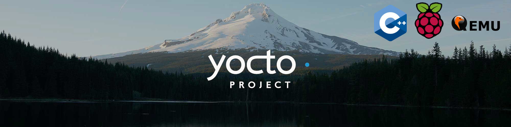
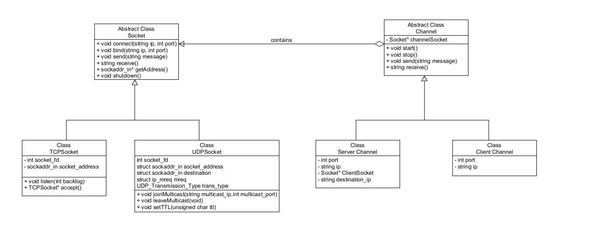
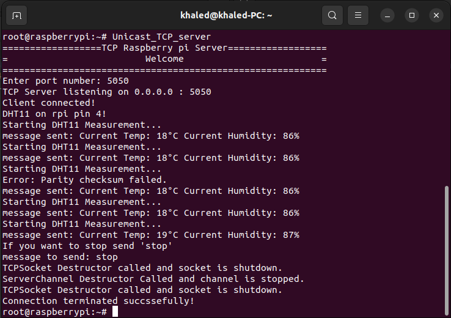
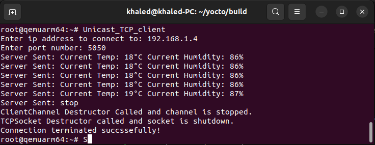
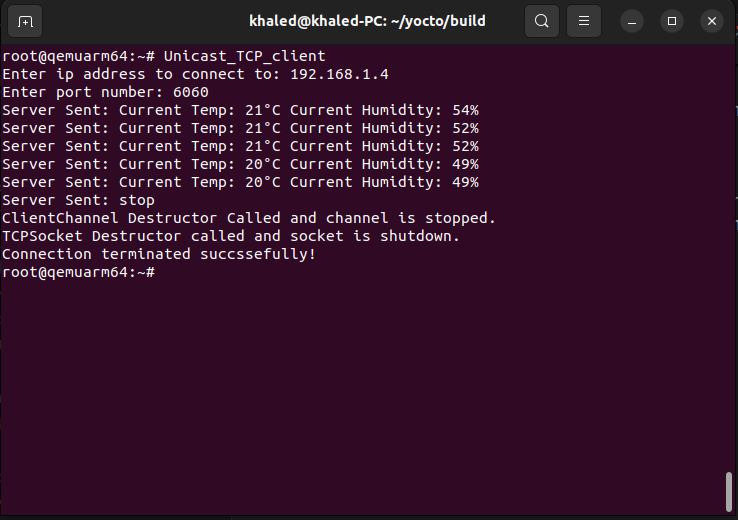

# IoT Device Communication System


## **📌 Overview**
This project implements an IoT device communication system using C++ with Yocto for Raspberry Pi and QEMU. The system transmits sensor data between a central server running on Raspberry Pi that is connected to the sensor and multiple clients (emulated on QEMU). The communication occurs through TCP and UDP sockets, implemented in C++.
### **Table of Contents**
* [System Architecture](#📖-system-architecture)
* [Detailed Description](#ℹ️-detailed-description)
* [C++ Design Choices](#🛠️-c-design-choices)
* [Build Instructions](#🔧-build-instructions)
  * [Run on PC](#1--to-run-the-server-and-clients-on-your-pc)
  * [Create Linux Image for QEMU](#2--to-create-the-images-for-qemu-using-yocto)
  * [Create Linux Image for Raspberry Pi](#3--to-create-the-images-for-raspberry-pi)
* [Hardware Setup](#🔌-hardware-setup)
* [Example Output](#🖥️-example-output)
* [Acknowledgments](#📜-acknowledgments)

## **📖 System Architecture**
The system follows an **object-oriented approach** with the **Bridge design pattern**.

<div align="center">
  
</div>  

---
- The `Channel` class acts as an **abstraction**, while its implementations (`ServerChannel` and `ClientChannel`) use different **socket types**.
- Communication is handled using:
  - **TCP sockets** (for unicast communication).
  - **UDP sockets** (for unicast and multicast communication).
  - The sockets implementation is based on UNIX sockets.
- **Yocto** is used to build the **custom Linux image** for both QEMU clients and the Raspberry Pi.


## **ℹ️ Detailed Description**
Sensor data is transmitted from the server running on raspberry pi to the clients running on QEMU utilizing the `Channel` class and its derived classes `ServerChannel` and `ClientChannel`. This sensor data transmission is done using TCP sockets (unicast) or UDP Sockets (unicast or multicast). Server application is developed for the Raspberry pi and client application is developed for the QEMU clients. 

In this repo applications for TCP unicast and UDP multicast are provided. Yocto is used to build the Linux OS image to run on both QEMU and the raspberry pi and the files include the yocto recipes needed to create the images. 

Cmake is used for automating the building of the project provided a CmakeLists.txt file for building the project and running on your local machine and there also separate CmakeLists.txt file specific to each application that is used when creating the yocto image.

The `Unicast_TCP_server` for the raspberry pi includes HW modules for interfacing with the DHT11 temperature sensor and the GPIO pins. This is not added in the `Multicast_UDP_server` but it it can be added in a similar way.

## **🛠️ C++ Design Choices**
The **Bridge design pattern** was chosen to decouple communication logic (`Channel`) from the socket implementation (`Socket`).  

### **Why the Bridge Pattern?**
It allows independent evolution of `Channel` and `Socket` and makes it easy to support new socket types in the future achieving:
- **Modularity** ✅   
- **Flexibility** ✅
- **Code Reusability** ✅


## **🔧 Build Instructions**
### 1- To run the server and clients on your PC
1. Use Cmake to build the project go inside the build directory (create a build directory using `mkdir build` if it doesn't exist) and run
```bash
 cmake ..
 ```
2. After cmake finishes run make all inside the build directory
 ```bash
 make all
 ```
3. The output executable files will be found in the `./build/bin` directory.

### 2- To create the images for QEMU using yocto
1. Clone the yocto project repo by running the following:
```bash
mkdir yocto
cd yocto
git clone https://git.yoctoproject.org/poky
cd poky
git checkout -b kirkstone
cd ..
```
2. Add the recipes folder to `./yocto/poky/meta/recipes-examples/`

3. Intialize the build environment:
```bash
source poky/oe-init-build-env build_folder
```
4. Add the following lines to the `local.conf` file
```
MACHINE ?= "qemuarm64"
IMAGE_INSTALL += "openssh"
IMAGE_FEATURES += "ssh-server-openssh"
IMAGE_INSTALL:append = " nano"
IMAGE_INSTALL:append = " tcpclientqemu udpqemu"
```
5. You might also need to clone meta-openembedded and add the meta-oe layer to the `bblayers.conf` file in the BBLAYERS variable it should look like this (replace path_to_yocto_folder with the actual path):
```
BBLAYERS ?= " \
  /path_to_yocto_folder/yocto/poky/meta \
  /path_to_yocto_folder/yocto/poky/meta-poky \
  /path_to_yocto_folder/yocto/poky/meta-yocto-bsp \
  /path_to_yocto_folder/yocto/meta-my-layer \
  /path_to_yocto_folder/yocto/meta-openembedded/meta-oe \
  "
```
6. run bitbake command
```bash
bitbake core-image-minimal
```
7. now you can run the qemu clients using
```bash
runqemu qemuarm64 nographic
```
### 3- To create the images for raspberry pi
Note: In this project I used Raspberry Pi 1B+ V1.2 you might want to adjust the `MACHINE` variable according to the used device.

1. Add the recipes folder to `./yocto/poky/meta/recipes-examples/`
2. Intialize the build environment:
```bash
source poky/oe-init-build-env rpi_build
```
3. Add the following lines to the `local.conf` file
```
MACHINE ?= "raspberrypi"
IMAGE_INSTALL += "openssh"
IMAGE_FEATURES += "ssh-server-openssh"
IMAGE_INSTALL:append = " wpa-supplicant"
IMAGE_INSTALL:append = " iw"
IMAGE_INSTALL:append = " nano"
IMAGE_INSTALL:append = " tcprpiserver udprpiserver"
```
In this project I used an ethernet cable since  I used Raspberry Pi 1B+ V1.2 but if you have support for Wi-Fi you can add the following lines to the `local.conf` file
```
DISTRO_FEATURES:append = " bluez5 bluetooth wifi"
IMAGE_INSTALL:append = " linux-firmware-bcm43430 bluez5 i2c-tools python3-smbus bridge-utils hostapd dhcpcd iptables"
```

4. Make sure to have the following layers in the `bblayers.conf` file
```
BBLAYERS ?= " \
  /path_to_yocto_folder/yocto/poky/meta \
  /path_to_yocto_folder/yocto/poky/meta-poky \
  /path_to_yocto_folder/yocto/poky/meta-yocto-bsp \
  /path_to_yocto_folder/yocto/meta-raspberrypi \
  /path_to_yocto_folder/yocto/meta-openembedded/meta-oe \
  /path_to_yocto_folder/yocto/meta-openembedded/meta-python \
  /path_to_yocto_folder/yocto/meta-openembedded/meta-networking \
  "
```
5. run bitbake command
```
bitbake core-image-minimal
```
if there is issues in running this command try
```bash
bitbake -c cleanall tcprpiserver
bitbake -c cleanall udprpiserver
bitbake tcprpiserver
bitbake udprpiserver
bitbake core-image-minimal
```
6. After successful creation of the core-image-minimal to deploy to the raspberry pi using sdcard do the following
```bash
cd tmp/deploy/images/raspberrypi
mkdir sdcard
cp core-image-minimal-raspberrypi.wic.bz2 sdcard
cd sdcard
bzip2 core-image-minimal-raspberrypi.wic.bz2
```
7. check where the sdcard is mounted using `lsblk` or `fdisk -l`, assuming it is `/dev/sdb` (if this is not the first deployment to the sdcard use `umount` to unmount boot and root) run the following:
```bash
sudo dd if=core-image-minimal-raspberrypi.wic of=/dev/sdb bs=4M conv=fdatasync status=progress
sudo sync
```
## **🔌 Hardware Setup**

## **🖥️ Example Output**
SSH was used to connect to the raspberry pi:

```bash
ssh root@<ip-address>
```

### TCP Server Running on Raspberry Pi  
The following image shows the TCP server running on the Raspberry Pi. 



---

### TCP Client Running on QEMU  
This image demonstrates the TCP client running on a QEMU virtualized environment, receiving data from the server.



---

### TCP Client: Humidity Changes  
To test sensor output the humdity around the sensor was changed to be more dry. The image below captures this behavior.  




## **📜 License & Acknowledgments**
Project License file: [LICENSE](LICENSE)

This project includes code  ([HW Modules](yocto_recipes/TCP_server_RPI/files/src/HW_modules)) originally written by Steffen Rauh (Copyright © 2018 Steffen Rauh) and licensed under the MIT License. Some modifications were made to adapt the original code to this project.

Steffen Rauh's repository: https://github.com/Backbone81/raspberry-pi
